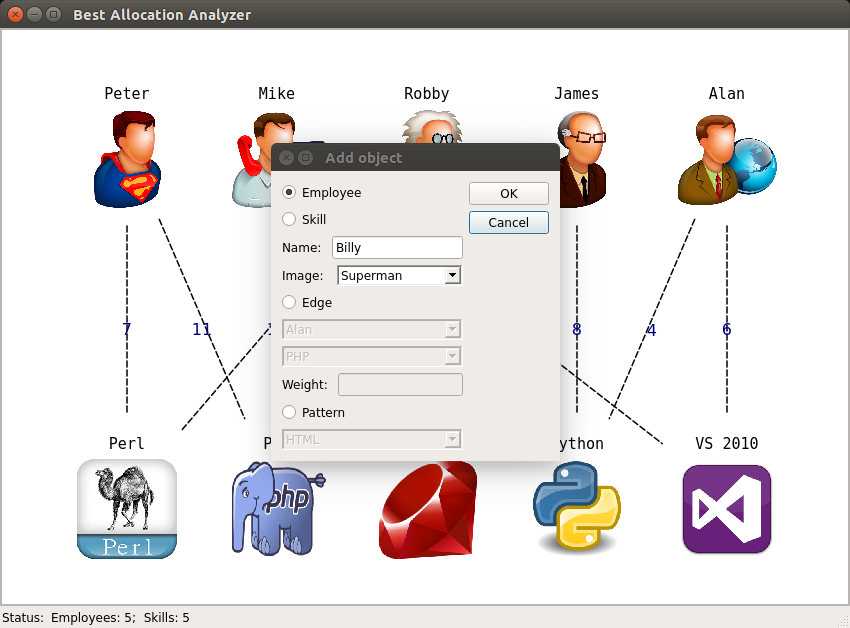

======================
Adding object to graph
======================

For adding objects (nodes and edges) to graph you can use two methods: 

1. From application menu (Edit -> Add object)

2. From context menu (Right click on view area -> Add object)

In both cases the following dialog box appears:

You can select type of the object for adding or add object from template.
