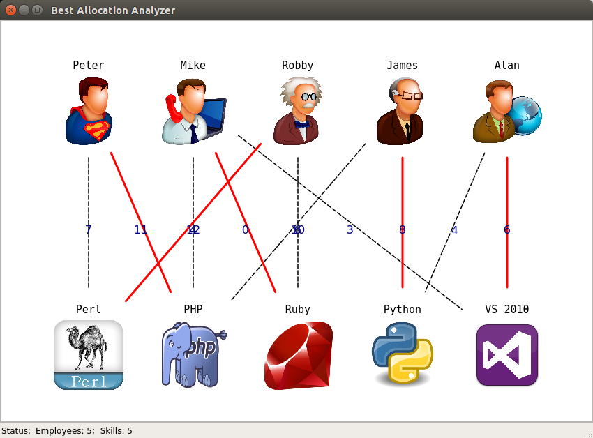

===========================
Calculating best allocation
===========================

After adding objects to graph you are finally ready to calculating of best allocation.
For calculating just click "Compute" from application menu ("Tools" -> "Compute") or from view area context menu.

The calculated allocation is displayed as red edges of the graph.

To clear view area from calculated data just click "Reset" from application menu or from view area context menu.
