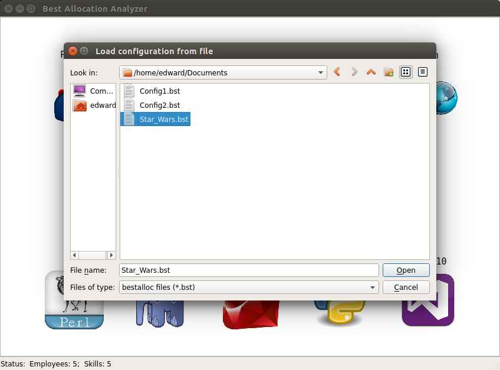

============================
Saving/Loading configuration
============================

You can save all added data to file for late use.
Just click "File" -> "Save" for saving configuration:

To load previously saved configuration click "File" -> "Load":

