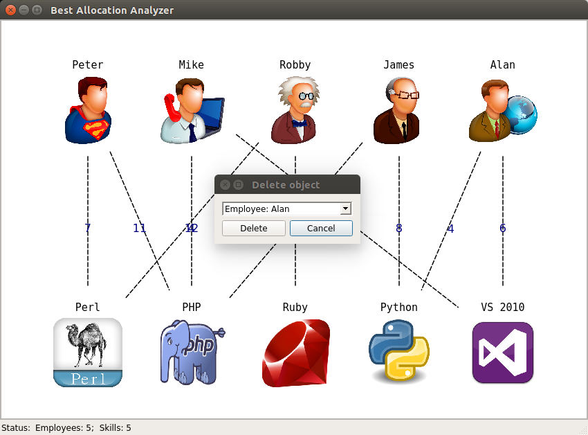
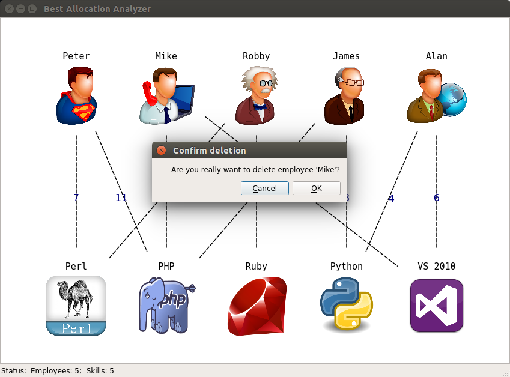

===============================
Deleting objects from the graph
===============================

The methods for deleting objects from graph are similar to adding: 

1. From application menu (Edit -> Delete object)

2. From context menu (Right click on view area -> Delete object)

In both cases the following dialog box appears:

Also you can delete nodes from their context menus.
Just right click on node and select "Delete".

