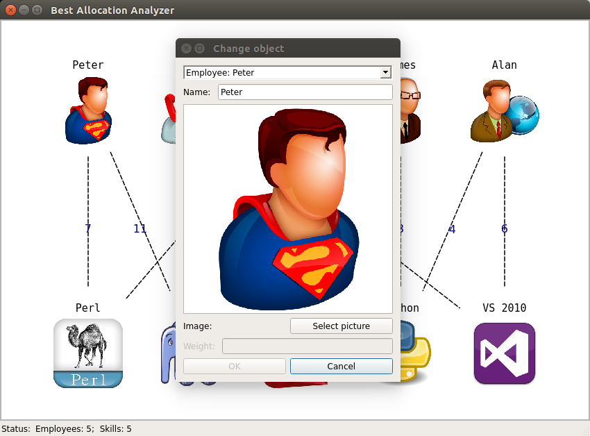
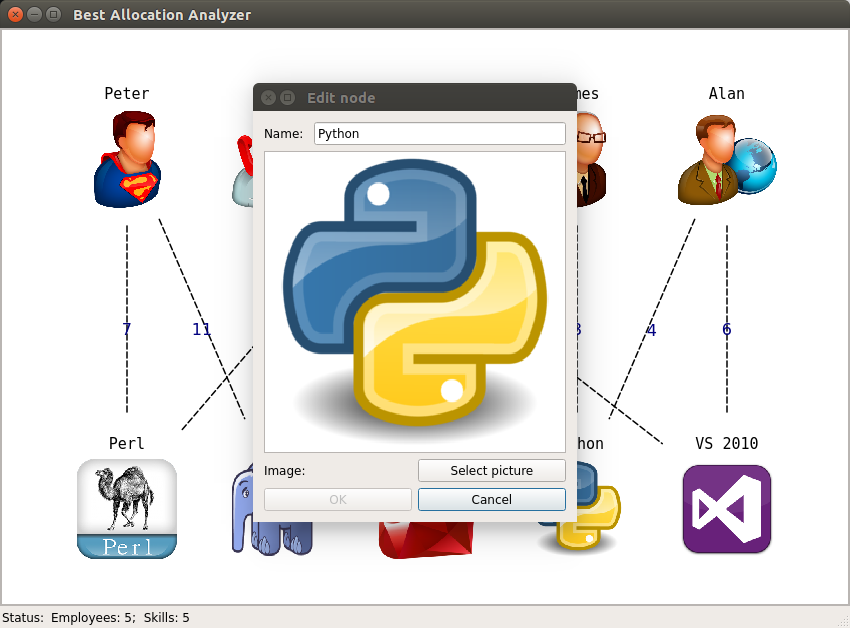

===========================
Editing object of the graph
===========================

And methods of editing graph object are also provided in two ways: 

1. From application menu (Edit -> Change object)

2. From context menu (Right click on view area -> Change object)

In both cases the following dialog box appears:

Also you can edit nodes from their context menus.
Just right click on node and select "Edit".

