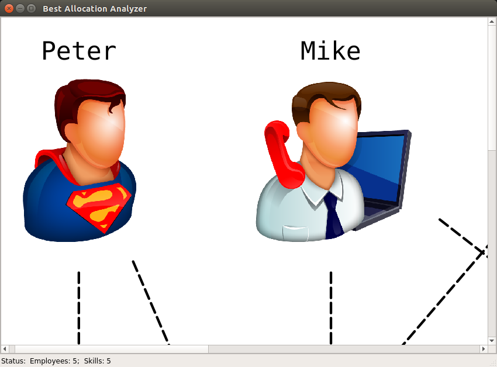
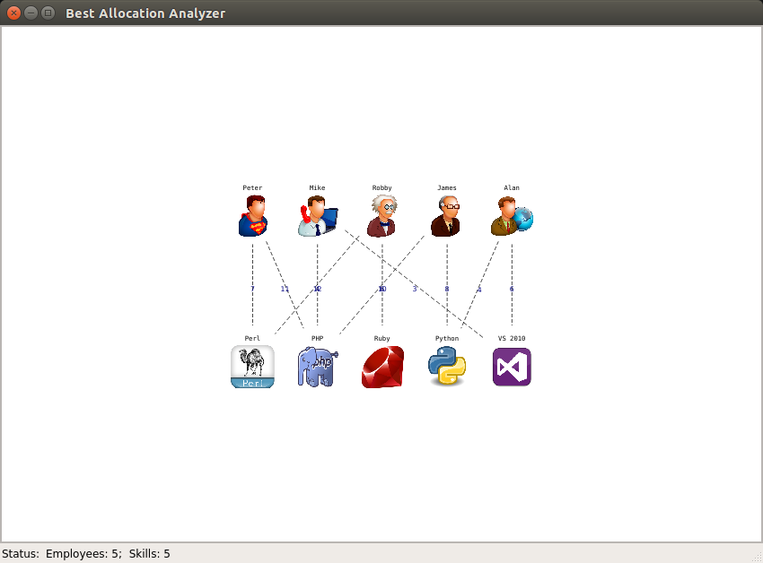

===================
Additional features
===================

If you have to show all you graph data on your screen you can change the size of objects.

To increase objects size just scroll up the mouse or click "Ctrl - '+'" 

To decrease objects size scroll down the mouse or click "Ctrl - '-'"

